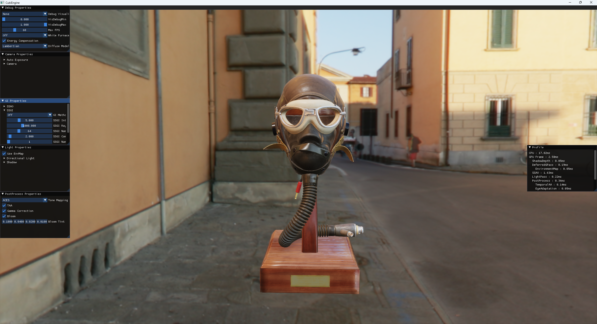
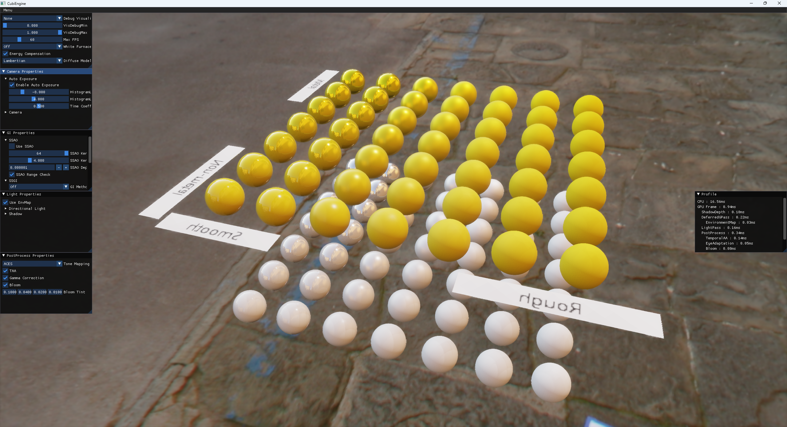
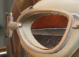
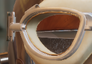
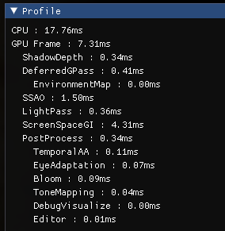
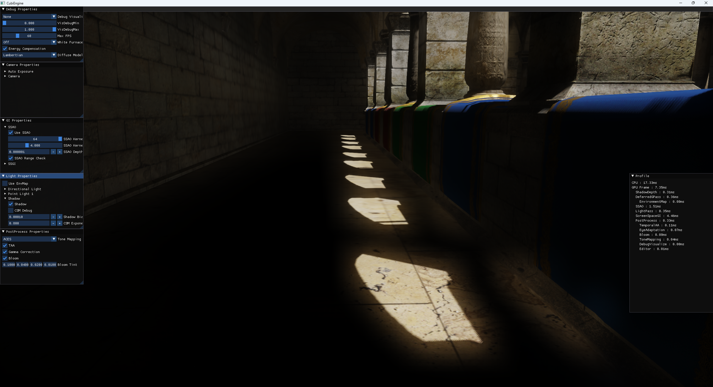
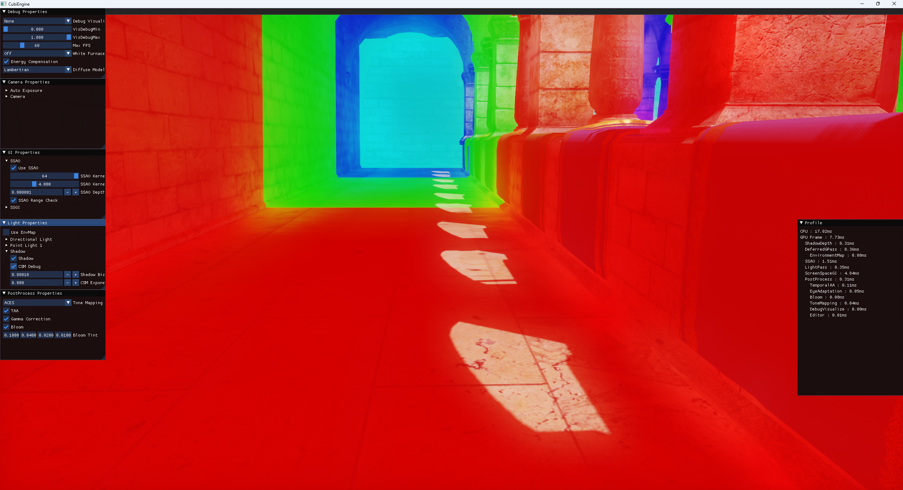
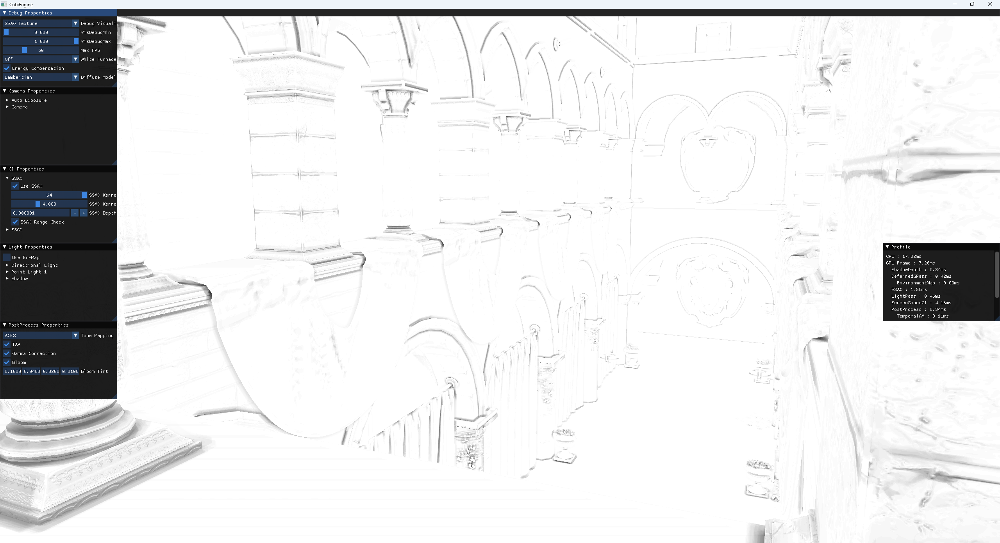
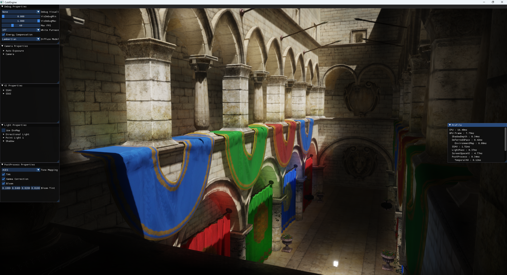

# CubiEngine
A DX12 renderer for experimenting modern graphics techniques.
- Windows only.

# Build

``` 
cmake -S . -B Build
```

+ Then open Build/CubiEngine.sln and build solution.

# Features
- Multi-Scattering BRDF
- Image Based Lighting
- Deferred Rendering
- Temporal Anti Aliasing
- Profile GPU + event marker
- Cascaded Shadow Map
- ToneMapping
- AutoExposure
- Bloom
- SSAO
- SSGI

# Images
### Multi-Scattering BRDF

### Image Based Lighting


### Temporal Anti Aliasing



### Profile GPU + event marker


### Cascaded Shadow Map



### SSAO


### SSGI


# Reference Projects
[Helios](https://github.com/rtarun9/Helios/tree/master) by rtarun9
[Cauldron](https://github.com/GPUOpen-LibrariesAndSDKs/Cauldron) by AMD

# 3rd-Party Open Source Projects Used
[IMGUI](https://github.com/ocornut/imgui)
[DirectXShaderCompiler](https://github.com/Microsoft/DirectXShaderCompiler)
[D3DX12](https://github.com/microsoft/DirectX-Graphics-Samples/tree/master/Libraries/D3DX12)
[stb](https://github.com/nothings/stb)