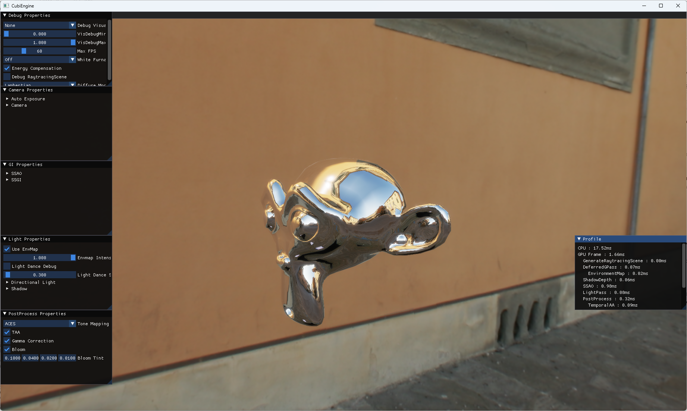

# CubiEngine
A DX12 renderer for learning new graphics techniques.

# Build
``` 
cmake -S . -B Build
```

+ Then open Build/CubiEngine.sln and build solution.

# Features
### Multi-Scattering BRDF

### Image Based Lighting


### Temporal Anti Aliasing


### Profile GPU + event marker


### Cascaded Shadow Map


### SSAO


### SSGI


# Reference Projects
[Helios](https://github.com/rtarun9/Helios/tree/master) By rtarun9
